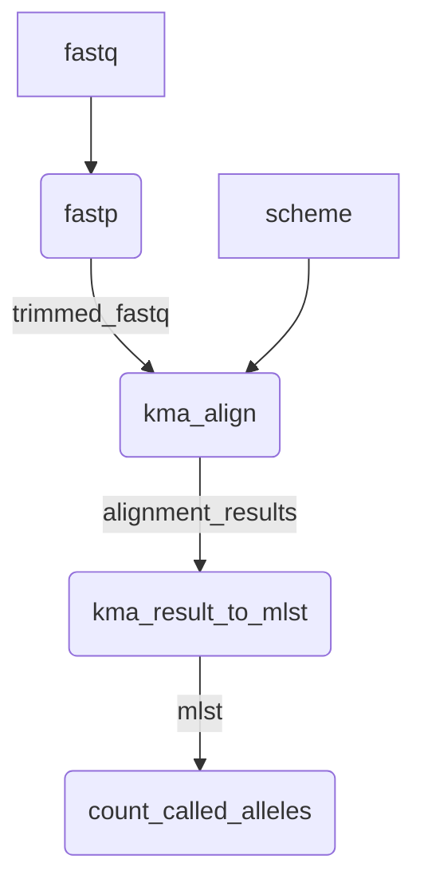

# KMA-cgMLST



## Usage

### Preparing your cgMLST scheme
First, prepare a single multi-fasta file containing all alleles. The [pubmlst_client](https://github.com/Public-Health-Bioinformatics/pubmlst_client)
tool may be helpful for finding and downloading MLST schemes.

The fasta deflines of each allele should follow the format: `locus_allele`. eg:
```
>MYCO000001_1
CGATCGATGCTATACTAGG.....
>MYCO000001_2
CGATGCTTAGCGATCTACGT....
```

Index the fasta using `kma`:
```
kma index -i <your_scheme.fa> -o <your_scheme>
```

### Running the pipeline

```
nextflow run BCCDC-PHL/kma-cgmlst \
  --nanopore <optional>
  --fastq_input </path/to/fastqs> \
  [--min_identity <min_percent_identity>] \
  [--min_coverage <min_percent_coverage>] \
  --scheme </path/to/cgmlst_scheme> \
  --outdir </path/to/output_dir> 
```

The `--min_identity` and `--min_coverage` flags can be used to control the identity and coverage thresholds that are used to call an allele. They both default to 100% if the flags are omitted.

The `--nanopore` flag may be activated to process basecalled signal data ('.fastq.gz', '.fq.gz', '.fastq', '.fq').

Alternatively, a `samplesheet.csv` file can be provided, with fields: `ID`,`R1`,`R2`:

```
ID,R1,R2
sample-01,/path/to/sample-01_R1.fastq.gz,/path/to/sample-01_R2.fastq.gz
sample-02,/path/to/sample-02_R1.fastq.gz,/path/to/sample-02_R2.fastq.gz
sample-03,/path/to/sample-03_R1.fastq.gz,/path/to/sample-03_R2.fastq.gz
```

When running the pipeline using samplesheet input, use the `--samplesheet_input` flag:

```
nextflow run BCCDC-PHL/kma-cgmlst \
  --samplesheet_input </path/to/samplesheet.csv> \
  --scheme </path/to/cgmlst_scheme> \
  --outdir </path/to/output_dir> 
```

If the `--collect_outputs` flag is added, several tabular outputs will be produced that
include results for all samples included in the analysis. See Outputs below for more details.

## Outputs

For each sample, the following outputs are produced:

```
.
├── SAMPLE-ID_YYYYMMDDHHmmss_provenance.yml
├── SAMPLE-ID_called_allele_count.csv
├── SAMPLE-ID_cgmlst.csv
├── SAMPLE-ID_fastp.csv
├── SAMPLE-ID_fastp.json
├── SAMPLE-ID_kma.csv
├── SAMPLE-ID_kma_mapstat.tsv
└── SAMPLE-ID_locus_qc.csv
```


### Collected Outputs

If the `--collect_outputs` flag is used, the following additional outputs will be
added to the top-level of the output directory (`--outdir`):

```
.
├── collected_called_allele_count.csv
├── collected_cgmlst.csv
└── collected_fastp.csv
```

The prefix of the filenames of the collected outputs can be controlled using
the `--collected_outputs_prefix` flag.

For example, the following command:

```
nextflow run BCCDC-PHL/kma-cgmlst \
  --fastq_input </path/to/fastqs> \
  --scheme </path/to/cgmlst_scheme> \
  --collect_outputs \
  --collected_outputs_prefix "demo" \
  --outdir </path/to/output_dir> 
```

...results in the following filenames fort the collected outputs:

```
.
├── demo_called_allele_count.csv
├── demo_cgmlst.csv
└── demo_fastp.csv
```

## Provenance

In the output directory for each sample, a provenance file will be written with the
following format:

```yml
- pipeline_name: BCCDC-PHL/kma-cgmlst
  pipeline_version: 0.1.3
  nextflow_session_id: ee5b4986-6ada-4eab-a294-ed0cbb18427d
  nextflow_run_name: furious_murdock
  analysis_start_time: 2024-02-01T16:37:26.062501-08:00
- input_filename: SAMPLE-ID_S133_L001_R1_001.fastq.gz
  file_type: fastq-input
  sha256: 1b6a9a616ec3fd8432ff02f51d60fb6443617c29761b96234ede9c65efe06547
- input_filename: SAMPLE-ID_S133_L001_R2_001.fastq.gz
  file_type: fastq-input
  sha256: f6954b1a174fbead8a035ae7cdfda549fcc751be8847a330505df49de59bed96
- process_name: fastp
  tools:
    - tool_name: fastp
      tool_version: 0.20.1
      parameters:
        - parameter: --cut_tail
          value: null
- process_name: kma_align
  tools:
    - tool_name: kma
      tool_version: 1.3.5
      parameters:
        - parameter: -ef
          value: null
        - parameter: -cge
          value: null
        - parameter: -boot
          value: null
        - parameter: -1t1
          value: null
        - parameter: -mem_mode
          value: null
        - parameter: -and
          value: null
```
